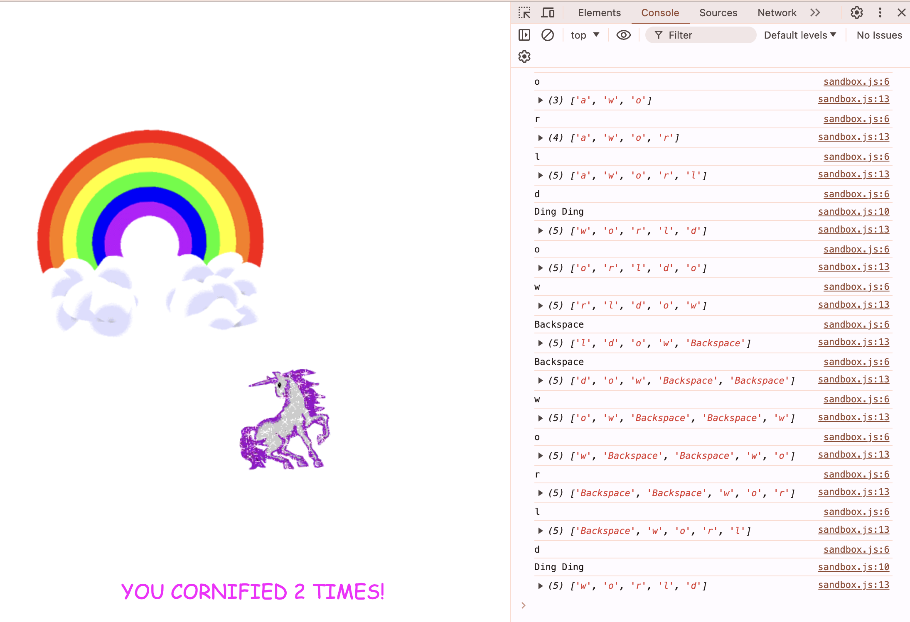

# key_sequence_detection

This is a 30-days javascript grinding  
js30 [https://github.com/ningh98/js30]  
12. Key Sequence Detection [https://github.com/ningh98/key_sequence_detection]

## Table of contents

- [Overview](#overview)
  - [Screenshot](#screenshot)
  - [Links](#links)
- [My process](#my-process)
  - [Built with](#built-with)
  - [What I learned](#what-i-learned)


## Overview

This JavaScript snippet listens for keyup events and checks for a specific secret code entered by the user. When the secret code is detected, it triggers a fun animation.

### Screenshot




### Links

- Live Site URL: [https://ningh98.github.io/key_sequence_detection/]

## My process

### Built with

- HTML
- CSS
- Javascript


### What I learned


```js

const pressed = []
const secretCode = 'world'

window.addEventListener('keyup', (e) =>{
    console.log(e.key)
    pressed.push(e.key)
    pressed.splice(-secretCode.length -1, pressed.length - secretCode.length)
    if(pressed.join('').includes(secretCode)){
        console.log('Ding Ding')
        cornify_add()
    }
    console.log(pressed)

})
```

